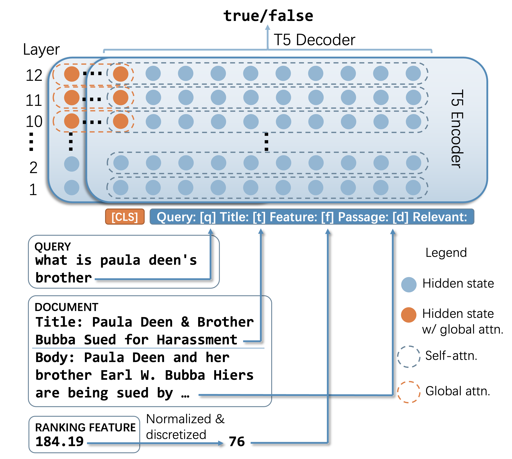

# Fusion-in-T5: Unifying Variant Signals for Simple and Effective Document Ranking with Attention Fusion
The code and datasets of our paper "[Fusion-in-T5: Unifying Variant Signals for Simple and Effective Document Ranking with Attention Fusion](https://arxiv.org/pdf/2305.14685.pdf)"

## Overview
<center>

</center>

## Requirements

```bash
pip install -r requirements.txt
```

python>=3.7

## Data Preparation

Prepare the retrieval data for coCondenser on MSMARCO.
This step can be completed using [Tevatron](https://github.com/texttron/tevatron/tree/main/examples/coCondenser-marco)
After that, we can obtain rank files for train, dev, and test data separately, as (train/dev/test)_rank.tsv.

Use ./data/process_(train\dev\test).py to process the training set, validation set, and test set, where the test set is MSMARCO dev, and the validation set is split from the training set.

## FiT5 first step

- 1.Prepare the scaled T5 model using `python ./development/model_fp16.py`.
- 2.Use `bash ./scripts/t5_train_passage_from_condenser_ddp_two_dev.sh` to obtain the initial model.
  - global_batch size=gradient_accumulation_steps*number of GPUs=16 (The default value for per_gpu_micro_batch size is 1)
  - `use_global`: Whether to use global attention.
  - `num_global_layers`: The last `num_global_layers` layers of the model use global attention.
  - `train/dev/test`: Set up the training set, validation set, and test set. The validation and test sets need to be provided with corresponding qrel data.

## FiT5 second step

- 1.Obtain the best checkpoint through the first step..
- 2.Use `bash ./scripts/t5_retrain_passage_from_condenser_ddp_two_dev.sh` for retraining to learn a model that incorporates coCondenser score information.
  - global_batch size=gradient_accumulation_steps*number of GPUs=256 (The default value for per_gpu_micro_batch size is 1)
  - `retraining`: This indicates that a checkpoint needs to be loaded for training.
  - `num_global_layers`: It needs to be consistent with the first step.
  - `add_score`: Scores will be added during data processing, mapped to 101 numbers from 0 to 100. add_bin is in discrete bin form, and number_bin is a specific number used as the bin token (keep these parameters unchanged).

Finally, use the results from 1500 steps as the final results.

## Inference

MSMARCO dev
```bash
bash ./scripts/t5_inference.sh
```

MSMARCO test
```bash
bash ./scripts/t5_inference_for_leader.sh
```

TREC DL 19/20
```bash
bash ./scripts/t5_inference_for_leader_trecdl.sh
```

## Checkpoints
FiT5-3layer: https://huggingface.co/OpenMatch/FiT5-msmarco
